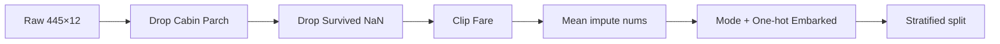

# Week 2 — Titanic Data Prep

> [!abstract] Pipeline
> [[Flat values|ตัดคอลัมน์ไม่ qualify]] → [[Missing values|ลบแถว target หาย]] → [[Outliers IQR]] → [[Imputation mean mode]] → [[One-hot encoding]] → [[Train test stratification]]



**โค้ดส่ง:** `homework/attachment_week2/student.py`  
**Notebook สอน:** `homework/attachment_week2/walkthrough_week2.ipynb`  
**แกะบรรทัดสำคัญ:** [[isna mean loc drop columns]]

---

## ข้อมูลตั้งต้น

| | |
|--|--|
| ไฟล์ | `titanic_to_student.csv` |
| shape | **445 × 12** |
| target | `Survived` |

### 4 คนตามไปทั้ง pipeline

| คน | Survived | Age | Fare | Cabin | Embarked | ผล |
|----|----------|-----|------|-------|----------|-----|
| Mrs. Cumings | 1 | 38 | 71.28 | C85 | C | แทบไม่โดน |
| Mr. Moran | 0 | NaN | 8.46 | NaN | Q | Age→29.14 |
| Mr. Fortune | 0 | 19 | **263** | C23… | S | Fare→74.05 |
| Master Goodwin | **NaN** | 11 | 46.9 | NaN | S | **ลบแถว** |

---

## Q1 — นับแถว → **445**

> [!note] Principle
> แถว = 1 observation

```python
n_rows = len(df)
# หรือ df.shape[0]
```

**Answer:** `445`

---

## Q2 — ตัดคอลัมน์ → **10**

> [!note] Principle
> ตัด**แนวตั้ง** — คนยังครบ 445 คน  
> รายละเอียด: [[Missing values]] · [[Flat values]] · [[isna mean loc drop columns]]

### 2.1 missing > 50%

```python
# expanded — ดูเต็มใน [[isna mean loc drop columns]]
missing_ratio = df.isna().mean()   # Cabin 0.739
mask = missing_ratio <= 0.5
df = df.loc[:, mask]

# compact (student.py)
# df = df.loc[:, df.isna().mean() <= 0.5]
```

### 2.2 flat > 70% (ยกเว้น Age, Fare)

```python
flat_cols = []
for col in df.columns:
    if col in ("Age", "Fare"):
        continue
    if df[col].value_counts(normalize=True, dropna=False).max() > 0.7:
        flat_cols.append(col)  # Parch
df = df.drop(columns=flat_cols)
```

> [!example] Before → After
> คอลัมน์ **12 → 10** (ตัด `Cabin`, `Parch`) · แถว **445 คงเดิม**

**Answer:** `10`

---

## Q3 — ลบ target หาย → **432**

> [!warning] จาก slide
> Missing ที่ **target** ห้ามเดา → ลบแถว → Master Goodwin หาย

```python
n_miss = df["Survived"].isna().sum()  # 13
df = df.dropna(subset=["Survived"])
# 445 - 13 = 432
```

**Answer:** `432`

---

## Q4 — clip Fare → **26.27**

ดูสูตรใน [[Outliers IQR]]

```python
fare = df["Fare"].copy()
q1, q3 = fare.quantile(0.25), fare.quantile(0.75)
iqr = q3 - q1
lower, upper = q1 - 1.5 * iqr, q3 + 1.5 * iqr  # upper=74.05
fare = fare.clip(lower=lower, upper=upper)
round(fare.mean(), 2)  # 26.27
```

> [!example] Mr. Fortune
> `263` → `74.05` · mean ทั้งตาราง `34.24 → 26.27`

**Answer:** `26.27`

---

## Q5 — impute Age → **29.14**

ดู [[Imputation mean mode]]

```python
num_means = df.select_dtypes(include="number").mean()
df = df.fillna(num_means)
round(df["Age"].mean(), 2)  # 29.14
```

> [!example] Mr. Moran
> Age `NaN` → `29.14` · Embarked ยังเป็นข้อความ / อาจยัง NaN จน Q6

**Answer:** `29.14`

---

## Q6 — one-hot Embarked → **0.06**

ดู [[One-hot encoding]] · [[Imputation mean mode]]

```python
# 1) mode ก่อน (ตาม slide)
df["Embarked"] = df["Embarked"].fillna(df["Embarked"].mode()[0])  # S

# 2) dummy / OneHotEncoder
dummy = pd.get_dummies(df, columns=["Embarked"])
round(dummy["Embarked_Q"].mean(), 2)  # 27/445 ≈ 0.06
```

| เดิม | C | Q | S |
|------|---|---|---|
| C | 1 | 0 | 0 |
| Q | 0 | 1 | 0 |
| S / NaN→S | 0 | 0 | 1 |

**Answer:** `0.06`

---

## Q7 — stratify split → **0.41**

ดู [[Train test stratification]]

```python
df = df.fillna(df.select_dtypes(include="number").mean())
y = df["Survived"]
X = df.drop(columns=["Survived"])
X_train, X_test, y_train, y_test = train_test_split(
    X, y, test_size=0.3, random_state=123, stratify=y
)
round((y_train == 1).mean(), 2)  # 0.41
```

> [!note]
> `main.py` impute ตัวเลขให้ก่อนเรียก Q7 (รวม Survived ที่ว่าง → มีค่ากลางปน) — นับสัดส่วนด้วย `(y_train == 1)`

**Answer:** `0.41`

---

## Cheatsheet คำตอบ

| Q | Answer | แตะอะไร |
|---|--------|---------|
| Q1 | 445 | — |
| Q2 | 10 | คอลัมน์ |
| Q3 | 432 | แถว |
| Q4 | 26.27 | ค่า Fare |
| Q5 | 29.14 | ค่า Age |
| Q6 | 0.06 | คอลัมน์ + ค่า |
| Q7 | 0.41 | ผ่าชุด |

#assignment #week2 #titanic
